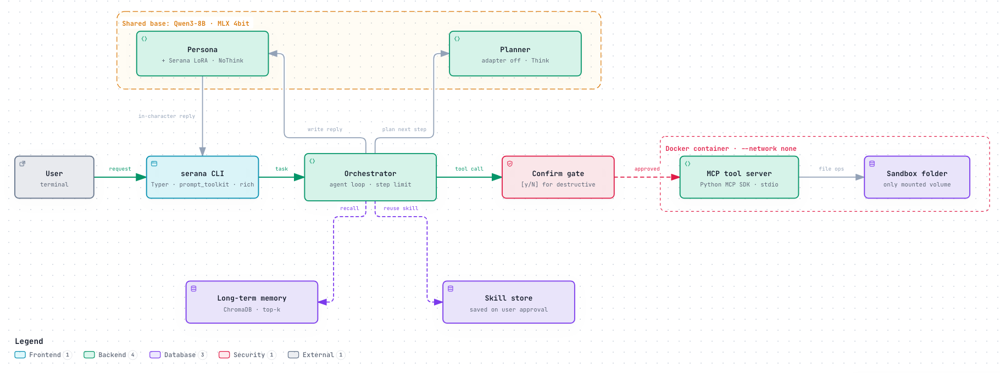

# Serana Agent

세라나 페르소나 어댑터(Qwen3-8B LoRA)에 파일 조작 툴, 장기 기억, 스킬 학습을 붙인 로컬 컴패니언 에이전트입니다. 캐릭터 말투를 유지하면서 샌드박스 폴더 안의 파일 작업을 하고, 맥북(Apple Silicon, MLX)에서 로컬로 돌아갑니다.

> **현재 상태**: 구현을 마쳤고 실제 8B 모델로 끝까지 실행됩니다. 어댑터 전환 검증(어댑터를 끈 출력 = 베이스 출력, 토큰 단위)을 통과했고 테스트 246개가 통과합니다. 실험 1~5와 작업셋 30개 정량 평가, Docker 모드 검증은 아직입니다.



## 핵심 설계

- **플래너와 페르소나 분리, 모델 하나 공유**: 툴 호출은 베이스 모델(어댑터 끔, Think)이 정하고, 최종 응답만 세라나 어댑터(켬, NoThink)가 씁니다. 두 역할이 MLX 4bit 베이스 하나를 공유하고 호출마다 `LoRALinear.scale`을 0과 2.0 사이에서 바꿔, 모델 한 개 분량의 메모리로 돌립니다.
- **서버가 강제하는 확인 게이트**: 덮어쓰기, 삭제 같은 파괴적 툴 호출은 `confirmed: true`가 없으면 MCP 서버가 실행하지 않습니다. 플래너는 이 인자를 볼 수 없고, 사용자가 `[y/N]`에서 승인한 뒤에만 오케스트레이터가 붙입니다.
- **두 겹의 샌드박스**: 서버 코드가 루트 밖 경로, `..`, 심볼릭 링크 우회를 거부하고, Docker 컨테이너(`--network none`, non-root, read-only, `--cap-drop ALL`)가 샌드박스 폴더 밖을 보이지 않게 막습니다.
- **학습 프롬프트 그대로 쓰기**: 어댑터는 SFT 학습 때의 시스템 프롬프트에서만 말투를 유지해서, 페르소나 호출은 학습 프롬프트(`agent/persona.py`, sha256으로 고정)에 에이전트 규칙만 덧붙여 씁니다. 플래너의 최종 보고는 페르소나가 말투를 따라 하지 않도록 짧은 영어 메모로 씁니다.

자세한 설계와 근거는 [설계 문서](serana-agent-design.md), 구현 결정은 [구현 계획](docs/implementation-plan.md)에 있습니다.

## 요구 사항

- Apple Silicon 맥, Python 3.12, [uv](https://docs.astral.sh/uv/)
- Hugging Face 캐시에 `Qwen/Qwen3-8B`와 `machu8/serana-sft` 어댑터
- 디스크: 변환한 4bit 모델 4.3GB (변환 중에는 bf16 원본을 읽으므로 메모리를 많이 씀)
- (선택) Docker: 툴 서버를 컨테이너에서 실행할 때
- (선택) `ANTHROPIC_API_KEY`, `OPENAI_API_KEY`: 플래너를 API 모델로 바꿀 때, `LANGSMITH_API_KEY`: 추적을 켤 때

## 시작하기

```bash
uv sync

# 1. 모델 변환: models/qwen3-8b-4bit, models/serana-adapter-mlx 생성
bash scripts/convert_base.sh
uv run python scripts/convert_adapter.py

# 2. 설정: Docker 없이 쓰려면 [sandbox] mode를 "host"로 바꾼다
cp serana.example.toml serana.toml

# 3. 실행: --root에는 에이전트가 다뤄도 되는 폴더를 지정한다
uv run serana --root ~/serana-test                      # 대화 모드
uv run serana --root ~/serana-test run "회의록 찾아서 요약해줘"   # 작업 하나 실행
```

`--root`를 주지 않으면 `~/.serana/workspace`를 씁니다. 기억, 스킬, 감사 로그는 `~/.serana/`에 저장되며 `SERANA_HOME`으로 위치를 바꿀 수 있습니다.

Docker 모드로 쓰려면 먼저 이미지를 빌드합니다([docker/README.md](docker/README.md)).

```bash
docker build -f docker/Dockerfile -t serana-mcp:latest .
```

## 대화 모드 명령

| 명령 | 동작 |
| --- | --- |
| `/memory [검색어]` | 저장된 기억 조회 |
| `/skills` | 저장된 스킬 목록 |
| `/trace` | 직전 작업의 툴 호출 내역 |
| `/model`, `/model list`, `/model <이름> [--full]` | 플래너 모델 확인·전환. `--full`이면 응답도 API 모델이 씀 |
| `/help`, `/exit` | 도움말, 종료 |

API 모델로 처음 바꿀 때는 외부로 나가는 정보를 보여주고 확인을 받습니다. LangSmith 추적은 `serana eval`에서만 기본으로 켜지고, 대화 모드와 `run`에서는 `--trace`와 확인을 거쳐야 켜집니다.

## 평가

```bash
uv run serana eval eval_tasks              # 작업셋 30개 (1~2스텝 10, 3~5스텝 10, 10스텝 이상 5, 안전 5)
uv run serana eval eval_tasks --task-id l1-find-file
```

작업 성공은 샌드박스의 최종 파일 상태로 판정하고, 확인 게이트는 작업마다 정해 둔 정답(승인/거부)으로 자동 응답합니다. 결과는 최소 스텝 수별 성공률과 부트스트랩 95% 신뢰구간으로 냅니다. 작업 정의 형식은 [eval_tasks/README.md](eval_tasks/README.md)에 있습니다.

모델 실험 스크립트는 `experiments/`에 있습니다(실험 1: 툴 호출 스모크 테스트, 실험 2: 양자화 조건별 페르소나 점수).

## 테스트

```bash
uv run pytest                # 모델이 없으면 model 테스트는 건너뜀
uv run pytest -m model       # 변환한 실제 모델로 어댑터 전환 검증
uv run pytest -m docker      # Docker 데몬과 serana-mcp 이미지 필요
uv run ruff check && uv run ruff format --check src tests
```

## 구조

```
src/serana_agent/
  agent/    에이전트 루프, 확인 게이트, 감사 로그, 페르소나 프롬프트
  llm/      로컬 MLX 모델(어댑터 전환), API 모델, 툴 호출 파싱, 모델 레지스트리
  tools/    MCP 툴 서버(툴 9개), 샌드박스 경로 검사, 클라이언트, Docker 실행 설정
  memory/   ChromaDB 장기 기억, 세션 종료 회고
  skills/   스킬 저장소와 궤적에서 스킬 추출
  eval/     평가 러너, 채점, 리포트, LangSmith 동기화
  cli/      Typer CLI와 대화 세션
eval_tasks/   평가 작업 30개
experiments/  실험 1·2 스크립트
scripts/      모델·어댑터 변환
docker/       툴 서버 이미지
```

---

"Serana"와 The Elder Scrolls는 Bethesda/ZeniMax의 소유입니다. 비상업적 엔지니어링 포트폴리오이며 공식 제품이 아닙니다.
