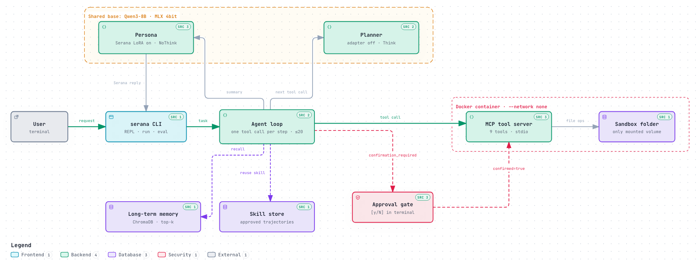

# Serana Agent

세라나 페르소나 어댑터(Qwen3-8B LoRA)로 캐릭터 말투를 유지하면서 파일 작업을 하는 로컬 에이전트입니다. Apple Silicon 맥에서 MLX로 돌아갑니다.



**현재 상태**: 실제 8B 모델로 끝까지 동작합니다. 정량 평가(작업셋 30개)와 Docker 모드 검증은 아직입니다.

## 핵심 설계

- **모델 하나, 역할 둘**: 플래너(어댑터 끔)가 툴 호출을 정하고, 페르소나(어댑터 켬)가 최종 응답만 씁니다. MLX 4bit 베이스 하나를 공유하고 호출마다 LoRA scale을 바꿉니다.
- **서버가 강제하는 승인**: 덮어쓰기와 삭제는 `confirmed=true` 없이 MCP 서버가 실행하지 않습니다. 이 값은 사용자가 `[y/N]`으로 승인한 뒤에만 붙습니다.
- **두 겹의 샌드박스**: 서버 코드의 경로 검사와 Docker 컨테이너(`--network none`, read-only)로 샌드박스 폴더 밖을 막습니다.
- **학습 프롬프트 그대로**: 어댑터는 SFT 때의 시스템 프롬프트에서만 말투를 유지해서, 페르소나는 그 프롬프트를 그대로 씁니다.

## 빠른 시작

```bash
uv sync
bash scripts/convert_base.sh                  # Qwen3-8B → MLX 4bit
uv run python scripts/convert_adapter.py      # PEFT 어댑터 → MLX
cp serana.example.toml serana.toml            # Docker 없이 쓰려면 [sandbox] mode = "host"

uv run serana --root ~/serana-test            # 대화 모드
uv run serana --root ~/serana-test run "회의록 찾아서 요약해줘"
```

Hugging Face 캐시에 `Qwen/Qwen3-8B`와 `machu8/serana-sft`가 있어야 합니다. 대화 모드에서는 `/help`로 명령을 볼 수 있습니다.

## 평가와 테스트

```bash
uv run serana eval eval_tasks    # 작업셋 30개, 최종 파일 상태로 자동 채점
uv run pytest                    # -m model: 실제 모델, -m docker: 컨테이너
```

## 문서

- [설계 문서](serana-agent-design.md): 구조, 안전장치, 평가 설계와 근거
- [구현 계획](docs/implementation-plan.md): 구현하면서 정한 세부 규칙
- [평가 작업 형식](eval_tasks/README.md), [Docker 이미지](docker/README.md)

---

"Serana"와 The Elder Scrolls는 Bethesda/ZeniMax의 소유입니다. 비상업적 포트폴리오이며 공식 제품이 아닙니다.
